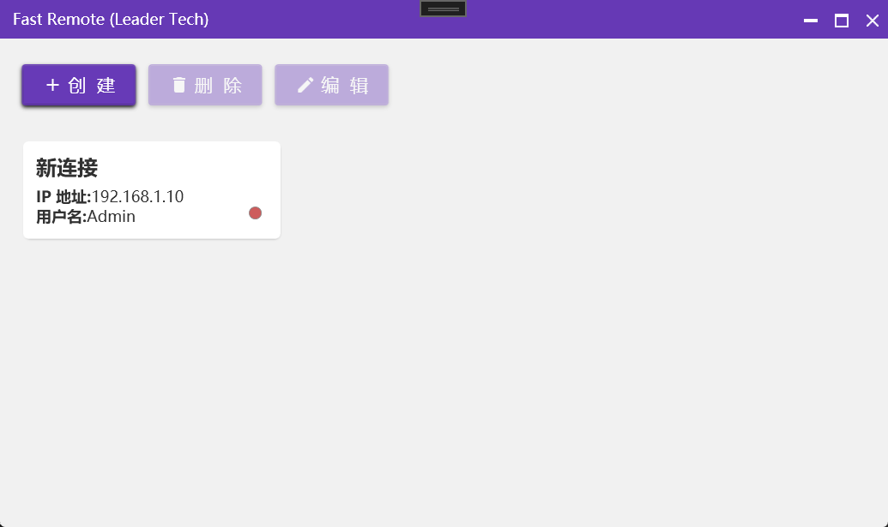

# FastRemote

一款快速、高效的远程连接管理工具，使用 C# 和 WPF 构建。



## 关于项目

FastRemote 是一个桌面应用程序，旨在为用户提供一个简洁、快速的方式来管理和启动多个远程连接。项目采用 MVVM (Model-View-ViewModel) 设计模式，确保了代码的结构清晰和可维护性。

## 主要功能

- **连接管理**: 集中管理您的所有远程连接。
- **快速创建**: 通过直观的对话框快速添加新的连接配置。
- **简洁界面**: 干净的用户界面，专注于核心功能，提升用户体验。

## 开始使用

请按照以下步骤在本地设置和运行项目。

### 环境要求

- [.NET Desktop Runtime](https://dotnet.microsoft.com/download/dotnet)
- [Visual Studio 2019](https://visualstudio.microsoft.com/) 或更高版本

### 安装与构建

1.  克隆仓库
    ```sh
    git clone https://github.com/your_username/FastRemote.git
    ```
2.  在 Visual Studio 中打开 `FastRemote.sln`。
3.  选择 `Debug` 或 `Release` 配置。
4.  按下 `F5` 或点击 "启动" 按钮来构建和运行应用程序。

## 技术栈

- **C#**: 主要编程语言。
- **.NET / WPF**: 用于构建桌面用户界面的框架。
- **MVVM**: 应用的体系结构模式，用于分离业务逻辑和用户界面。

## 贡献

欢迎对项目做出贡献！如果您有好的想法或发现了 Bug，请随时创建 Issue 或提交 Pull Request。

## 许可证

该项目根据 MIT 许可证授权。有关详细信息，请参阅 `LICENSE` 文件。
